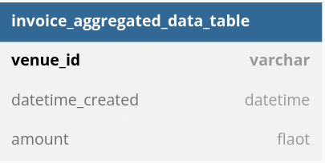
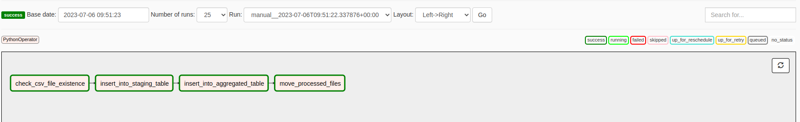

# Data engineering data pipeline using Airflow

### Objective
Building a data pipeline to ingest the data from a given file location and process them into a database.
The dataset contains information about invoices.

We need to build a data pipeline which will ingest raw data, aggregate and
store them into the database.

---
### Dataset

**Invoice Data:**

The invoice records include fields invoice_id, venue_id, datetime_created and amount in euro currency.

---
### Assumptions made

1. The "invoice records" will be placed in the source folder on daily basis by different teams inside the company.
2. There will be only csv files with this naming convention "invoices_20191015.csv"  will be ingested.
3. Once the files have been processed, we will move the files from data_files folder to processed_data_files folder.
4. The dag is scheduled to run after every 10 minutes.
   
---

### Tech stack

* Docker
* Python
* Airflow
* Postgres

---
### Environment Setup
- Download the project and unzip it
- Open terminal and navigate to the project folder where docker-compose.yml file exists.
- Run the below command:

```
docker-compose up --build
```

Now the airflow and postgres containers are up and running 

Open the airflow UI at 
http://localhost:8080/admin/

---

### Data Model

When we first run the docker, the required tables are loaded into the 
postgres database.

**Tables:**

|Table Name   | Description  |
|-------------|-----------|
|staging_table|Table to store invoices data loaded from csv.|
|invoice_aggregated_data_table|Table contains aggregated amount against the venue_id and createddata_time.


**invoice_table**



**invoice_aggregated_data_table**


---
### Tasks

The data pipeline consists of the following tasks executed in order.

1. **check_if_file_exists:**
   
   i. Check if the csv file exists in the folder location '~/data_files_airflow'.

2. **insert_into_staging_table:**
   
   i. Read csv files from source folder.
   
   ii.Pre process and clean the data in the data frame.
   
   iv. Insert the processed data frame into DB.
   
    v. Push xcom value which is the month field as it will be used by other task for queries. 

3. **insert_into_aggregated_table:**
   
   i. Use the keys and query staging table. 
   
   ii. Aggregate the dataframe. 
   
   iii.Insert data into the invoice_aggregated_data_table.

4. **move_processed_files:**

   i.Check the files in source folder. 

   ii.Move the processed files into the destination folder. 

### Order of execution

check_file_operator >> prepare_staging_table >> prepare_aggregated_table >> move_data_files 

**Sucessful DAG execution:**



---
### SQL Queries

## Output
* open the terminal run the command
```
sudo docker exec -it PostgreSQL_Container_ID bash
```
* connect to the mysql
```
psql -h localhost -p 5432 -U airflow -d airflow

```
* get the output to run the sql queries
```
select * from invoice_table;
select * from invoice_aggregated_data_table;

```
---
## Run the test cases

* open the terminal run the command
```
sudo docker exec -it AIRFLOW_DATAPIPELINE_MAIN_SERVER_Container_ID bash

```

* To Run the unit test cases
```
	python -m unittest discover tests/

```


---
### Further Enhancements
* Use celery executor instead of local executor. I can't run the latest version of apache airflow on my system due hardware limitation.
* we can have separate table which can be used to generate monthly and yearly reports instead of daily aggregation.